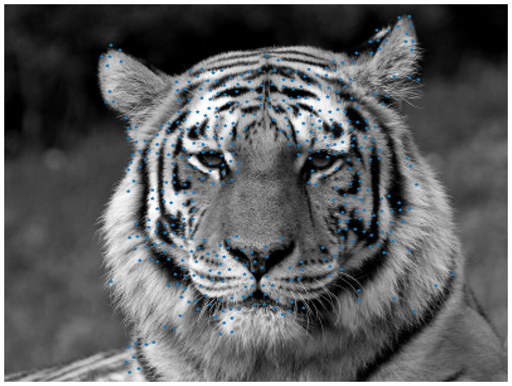

# msu_master
Scientific Python

Пакет для сопоставления изображений по ключевым точкам

def matching_SURF(train_image_path, test_image_path) - функция сопоставления

Например:

train_image_path = 'images/place_all.jpg'

  

test_image_path = 'images/place_1.jpg'

  

Далее:

im1, im2 = matching_SURF(train_image_path, test_image_path)

imshow(im1)

  

imshow(im2)

  

Для просмотра ключевых точек используйте функцию
compute_harris_response(im, sigma=3), где im считанное изображение

Например:

  

Результат:

  

Далее выявляем сами дискрипторы

f_c = get_harris_points(res, 6), где res полученное изображение после функции compute_harris_response

Воспользуйтесь кодом:

from matplotlib import pyplot as plt

plt.figure(figsize=(15, 15))

plt.gray()

plt.imshow(img)

plt.plot([p[1] for p in f_c], [p[0] for p in f_c], '*')

plt.axis('off')

plt.show()

Получите результат:

  

